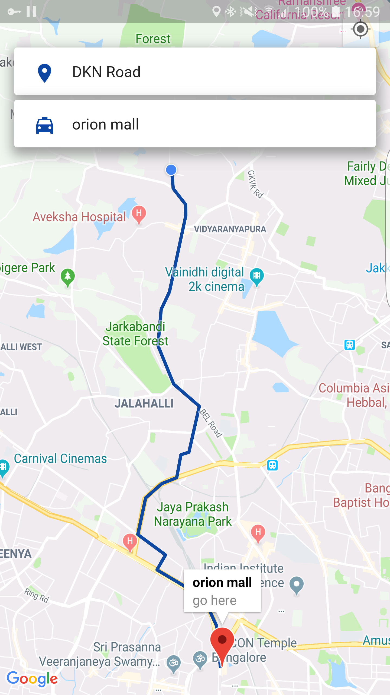

# Uber clone with flutter (rider side)

This is a clone of the famous application Uber, and its done with the flutter frame work, this particular repo, contains the code for the rider side

### Don't forget to insert your APIKEY for the project to work
* insert you Api key for android (android ->> app ->> src ->> main ->> manifest)
* insert your Api key for Ios (ios ->> runner ->> appdelegate.m)

## Authors Information
My name is Santos Enoque, I am a flutter and python developer, for more information please check the links bellow.

- [Youtube: Santos Enoque](https://www.youtube.com/channel/UCRl79zOEtiLCglAFZJJzEZQ)
- [LinkedIn: Santos Enoque](www.linkedin.com/in/santos-enoque)
- Skype: santos enoque

For help getting started with Flutter, view our 
[online documentation](https://flutter.io/docs), which offers tutorials, 
samples, guidance on mobile development, and a full API reference.
